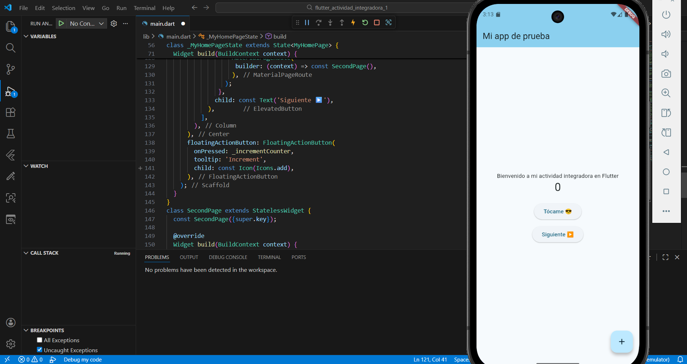

# Flutter Actividad Integradora 1

## Descripción
Aplicación desarrollada en Flutter como parte de la actividad integradora.
Incluye modificaciones básicas de interfaz, un SnackBar funcional y navegación
a una segunda pantalla utilizando Navigator.push y Navigator.pop.

## Captura de la aplicación en ejecución

